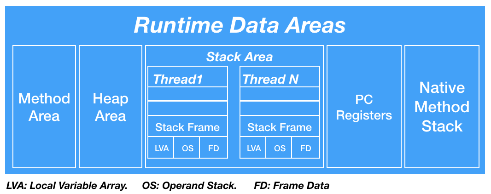

## Java 구조

<blockquote>
Java Development Kit&nbsp;&nbsp;&nbsp;&nbsp;&nbsp;&nbsp; = 개발자들이 자바로 개발하는데 필요한 라이브러리, javac, javadoc 등으로 구성 
Java Runtime Enviroment = 자바로 만들어진 프로그램을 실행하는데 필요한 라이브러리, API, JVM 등으로 구성
</blockquote>
 

## JDK 구조

  

## JVM 구조

<blockquote>
Garbage Collector&ensp;&nbsp; = 프로그램이 생성한 객체의 생존 여부를 판단하여 더 이상 사용되지 않는 객체를 해제 
Class Loader&ensp;&ensp;&ensp;&ensp;&ensp;&ensp;&nbsp; = JVM내로 클래스를 로드하고 링크를 통해 배치하는 작업을 수행 (동적로딩) 
Execution Engine&ensp;&ensp;&nbsp; = Runtime Data Area에 배치된 자바 바이트 코드를 명령어 단위로 읽어서 실행 
Runtime Data Areas&nbsp; = JVM이 운영체제 위에서 실행되면서 할당받는 메모리 영역
</blockquote>
 

## 메모리 구조 (Runtime Data Areas)

<blockquote>
Method Area&ensp;&ensp;&ensp;&ensp;&ensp;&ensp;&ensp;&ensp;&ensp;&ensp;&ensp; =  멤버 변수, 클래스 변수(Static 변수), 생성자와 메소드를 저장하는 공간 
Heap Area&ensp;&ensp;&ensp;&ensp;&ensp;&ensp;&ensp;&ensp;&ensp;&ensp;&ensp;&ensp;&ensp; =  객체와 배열을 저장 (스택 영역의 변수나 다른 객체의 필드에서 참조) 
Stack Area&ensp;&ensp;&ensp;&ensp;&ensp;&ensp;&ensp;&ensp;&ensp;&ensp;&ensp;&ensp;&ensp; = 메소드 정보, 지역변수, 매개변수, 연산 중 발생하는 임시 데이터 저장 (기본타입 변수는 스택영역에 저장됨) 
PC Register&ensp;&ensp;&ensp;&ensp;&ensp;&ensp;&ensp;&ensp;&ensp;&ensp;&ensp;&ensp; = 연산 결과값을 메모리에 전달하기 전 저장하는 CPU 내의 기억장치 (현재 수행 중인 JVM 명령 주소를 갖는다) 
Native Method Stack Area = 자바 외 언어로 작성된 네이티브 코드를 위한 Stack
</blockquote>
 