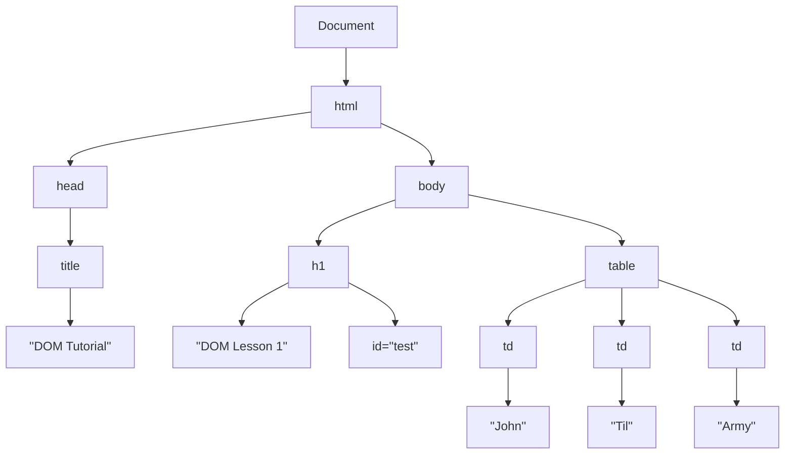

## Window
- 자바스크립트의 최상위 객체이자 전역 객체 이면서 모든 객체가 소속된 객체
  → 최상위에 있기 때문에 어디서든 접근이 가능
- 브라우저의 윈도우 창을 의미한다


## DOM (Document Object Model)
- 객체지향 모델로써 구조화된 문서를 표현하는 형식
  → 브라우저가 웹 문서를 이해할 수 있도록 구성한 것
  → 모든 요소들과의 관계를 부자 관계로 표현 가능한 트리 구조
- 자바스크립트를 통해 동적으로 변경 가능


```xml
<!DOCTYPE html>
<html>
	<head>
		<title>DOM Tutorial</title>
	</head>

	<body>
		<h1 id="test">DOM Lesson 1</h1>

		<table>
			<td>John</td>
			<td>Til</td>
			<td>Army</td>
		</table>
	</body>
</html>
```
|이름|설명|
|--|--|
|문서노드| 트리의 최상위|
|요소노드| 태그|
|어트리뷰트 노드| 태그안의 속성|
|텍스트 노드| 태그 내부의 텍스트 표현|
<br>

## BOM (Browser Object Model)
- 자바스크립트가 브라우저와 소통하기 위해 만들어진 모델
- 공식 표준은 아니지만 대부분의 브라우저가 비슷한 메소드와 속성으로 동작한다

|이름|설명|
|--|--|
|navigator | 브라우저명과 버전정보를 속성으로 가진다     |
|window    | 최상위 객체로, 각 프레임별로 하나씩 존재한다 |
|document  |  현재 문서에 대한 정보              |
|location  |  현재 URL에 대한 정보             |
|history   |   현재의 브라우저가 접근했던 URL 히스토리 |
|screen    |  브라우저의 외부 환경에 대한 정보를 제공   |