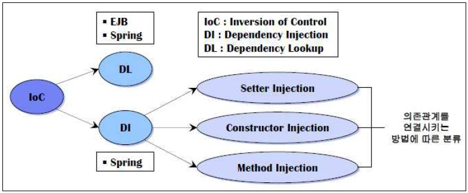

## Inversion of Control (제어의 역전)
- 프로그램의 흐름을 개발자가 아니라 프레임워크가 주도하는 것
→ 객체의 생성, 생명주기 등을 컨테이너가 관리한다 (IoC 컨테이너) 
→ 이로 인해 DI, AOP가 가능하게 된다
 

## 컨테이너
- 보통 인스턴스의 생명주기를 관리하며, 생성된 인스턴스들에게 추가적인 기능을 제공하도록하는 것
- 작성한 코드의 처리 과정을 위임받은 독립적인 존재 
- Servlet 컨테이너 = Servlet의 생성, 생성 후 초기화, 서비스 실행, 소멸에 관한 모든 권한을 가진다
- Spring(IoC) 컨테이너 = 종속객체 주입을 이용하여 애플리케이션을 구성하는 컴포넌트들을 관리한다 
 ex) 빈팩토리, 애플리케이션 컨텍스트
 

## 빈팩토리 (Bean Factory)
- DI의 기본사항을 제공하는 가장 단순한 컨테이너
- <ins>팩토리 디자인 패턴</ins>1을 구현한 것
- <ins>빈</ins>2을 생성하고 분배하는 책임을 지는 클래스
- 빈의 정의는 즉시 로딩하는 반면, 빈 자체가 필요하게 되기 전까지는 인스턴스화를 하지 않는다 (Lazy Loading)
 

## 애플리케이션 컨텍스트 (Application Context)
- 빈팩토리를 상속받아 확장시킨 것 (빈의 생성과 관계설정 외의 추가적인 기능 제공)
- 국제화가 지원되는 텍스트 메시지를 관리
- 이미지같은 파일 자원을 로드 할 수 있는 포괄적인 방법을 제공
- 리스너로 등록된 빈에게 이벤트 발생을 알려준다
- 미리 빈을 생성해 놓아 빈이 필요할 때 즉시 사용할 수 있도록 보장
 

---
**1. 팩토리 디자인 패턴** = 여러 개의 서브 클래스를 가진 슈퍼 클래스가 있을 때 인풋에 따라 하나의 서브 클래스의 인스턴스를 리턴해주는 방식
**2. 빈** = 스프링 컨테이너에서 관리하는 자바 객체 (@Bean을 이용하여 등록)