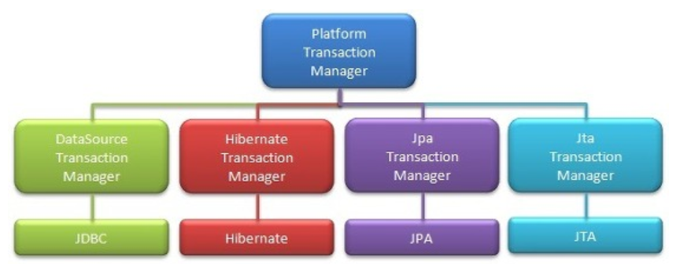

## 트랜잭션
- 트랜잭션이란 시스템에서 상호작용의 단위를 의미한다.
- DB와 JAVA언어가 데이터를 주고 받는 과정에 원자성을 부여하는 수단이다.
- 어떤 작업 프로세스를 하나로 묶어 실행 중 하나의 작업이라도 실패하면 모두 실패 처리를 해주고, 
전체 작업이 성공하면 성공 처리를 해주는 것이다
<br>

## 트랜잭션 지원
- 스프링은 어노테이션 방식으로 @Transactional을 선언하여 사용하는 방법이 일반적이며, 선언적 트랜잭션이라 부른다.
- 클래스, 메서드위에 @Transactional이 추가되면, 이 클래스에 트랜잭션 기능이 적용된 프록시 객체가 생성된다.
- 이 프록시 객체는 @Transactional이 포함된 메소드가 호출 될 경우, Platform Transaction Manager를 사용하여 트랜잭션을 시작하고, 
  정상 여부에 따라 Commit 또는 Rollback 한다.
<br>

## 트랜잭션의 성질
- 원자성 (Atomicity)&nbsp;&nbsp;&nbsp;&nbsp;&nbsp;&nbsp; = 한 트랜잭션 내에서 실행한 작업들은 하나로 간주한다. 즉, 모두 성공 또는 모두 실패
- 일관성 (Consistency)&nbsp; = 트랜잭션은 일관성 있는 데이타베이스 상태를 유지한다. (데이터 정합성 만족)
- 격리성 (Isolation)&nbsp;&nbsp;&nbsp;&nbsp;&nbsp;&nbsp;&nbsp; = 동시에 실행되는 트랜잭션들이 서로 영향을 미치지 않도록 격리해야한다
- 지속성 (Durability)&nbsp;&nbsp;&nbsp;&nbsp;&nbsp;&nbsp;  = 트랜잭션을 성공적으로 마치면 결과가 항상 저장되어야 한다
<br>

```java
@Transactional
public boolean insertUser(User user){
  ...
}
```

