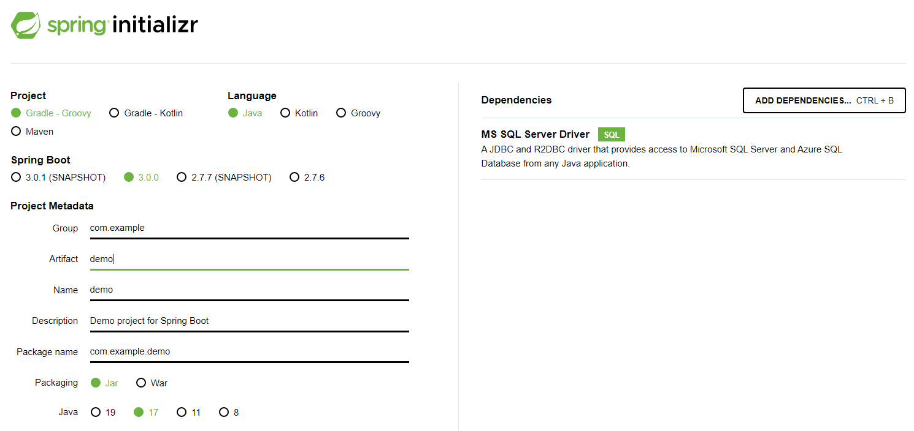

## 스프링 부트
- Spring 기반의 애플리케이션을 개발하기 쉽도록 기본 설정으로 빠르게 개발할 수 있게 하는 Spring 하위 프로젝트
→ 스프링을 더 쉽게 사용하기 위한 도구
→ 스프링을 쉽게 사용할 수 있도록 필요한 설정을 대부분 미리 세팅함
 

## 기능
- 단독으로 실행이 가능한 스프링 애플리케이션을 생성함
- Tomcat, Jetty, Undertow 를 내장 (WAS 설치 필요없음)
- 기본설정이 되어있는 Starter 컴포넌트를 제공
- 가능한 자동으로 설정되어 있음
- 상용화에 필요한 통계, 상태 체크, 외부 설정 등을 제공
- 설정을 위한 XML 코드를 생성하거나 요구하지 않음
 

