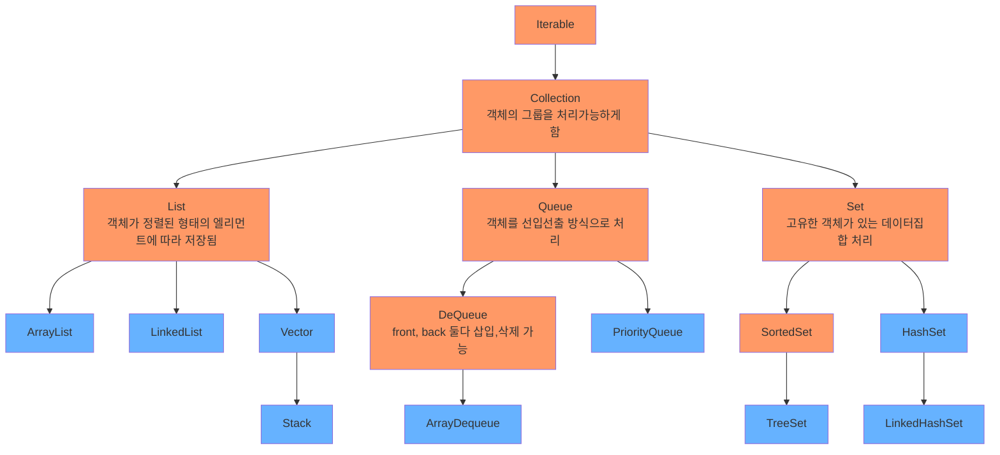
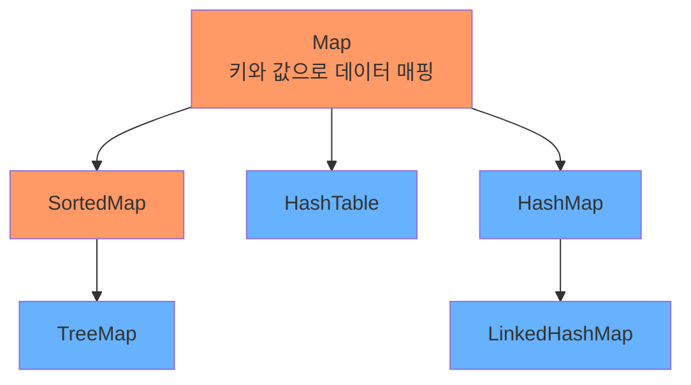
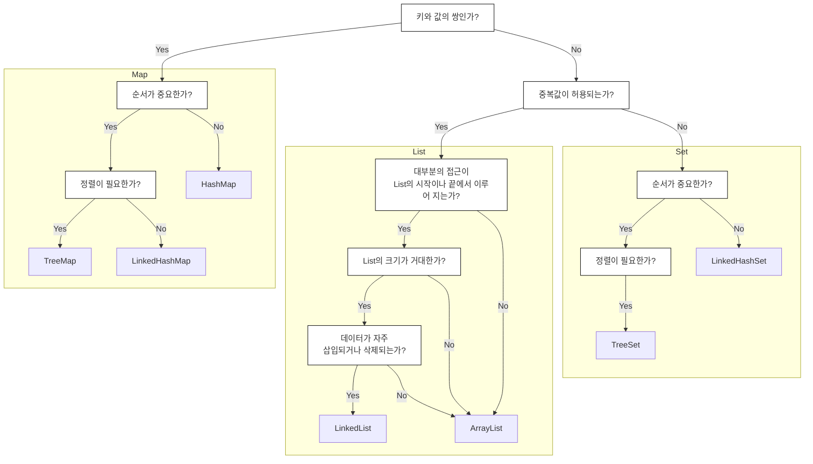

## [Java Collection Framework](https://devdocs.io/openjdk~8/java/util/package-summary)
- 데이터를 저장하는 자료구조들을 한 곳에 모아 편리하게 관리하고 사용하기 위해 제공하는 것

> 🟠 <b>인터페이스</b> 🔵 <b>클래스</b>





<br>

---



---

|유형|이름|순서 처리|정렬 여부|중복 허용|동기화 지원|null 허용|
|:--:|--|--|:--:|:--:|:--:|:--:|
|List|ArrayList| 인덱스| O| X| X| O (여러개)|
|List|LinkedList | 인덱스 | X| O| X| O (여러개)|
|List|Vector|인덱스|X|O|O|O (여러개)|
|List|Stack|후입선출|X|O|O|O (여러개)|
|Queue|ArrayDeque|삽입순서|X|O|X|X|
|Queue|PriorityQueue|우선순위|O|O|X|X|
|Set|TreeSet|정렬순서|O|X|X|X|
|Set|HashSet|X|X|X|X|O (1)|
|Set|LinkedHashSet|삽입순서|X|X|X|O (1)|
|Map|TreeMap|균형|O|X|X|X|
|Map|HashTable|X|X|X|O|X|
|Map|HashMap|X|X|X|X|O (1)|
|Map|LinkedHashMap|삽입순서|X|X|X|O (1)|


> [List](#array-list)
> [Queue](#array-dequeue)
> [Set](#tree-set)
> [Map](#tree-map)

---

## Array List
- 중복 데이터 허용
- 멀티쓰레드 환경에서 동기화를 제공하지 않음
- 삽입순서 유지
- 인덱스 기반으로 작동되어 무작위 접근 가능
- 데이터가 삭제되면 그 이후의 데이터가 앞으로 땡겨지는 연산이 실행된다
 → 삽입, 삭제가 빈번히 발생하면 효율 낮아진다
- 배열의 길이가 동적으로 조절된다 
 → 용량 초과시 더 큰 용량의 배열 생성후 이동
 - 원시타입은 사용할 수 없기 때문에 필요시 Wrapper 사용

```java
List<String> list = new ArrayList<String>();
list.add("Alpha");
list.remove("Alpha");
// []
```

<br>

## Linked List
- 내부적으로 양방향 연결 리스트로 구성되어 있어 참조하려는 원소에 따라 정방향 혹은 역순으로 순회가능
- 중복 데이터 허용
- 삽입순서 유지
- 동기화 기능 없음
- 데이터 삽입, 삭제시 가리키는 주소값만 변경되기 때문에 효율적이다
- List, Stack, Queue 으로 활용 가능

```java
List<String> list = new LinkedList<String>();
list.add("Alpha");
list.addFirst("Beta");
list.removeLast();
// ["Beta"]
```


<br>

## Vector
- 삽입 순서가 유지되고 동기화를 지원한다
  → 쓰레드 환경에서 안정성이 높으나 조회, 삽입, 삭제가 느리다
- 기본형 데이터는 Wrapper 클래스로 자동 변환되어 저장된다
- 컬렉션 프레임워크 외의 다른 메소드가 많이 포함되어 있음

```java
List<String> list = new Vector<String>();
list.add("Alpha");
list.remove("Alpha");
// []
```

<br>

## Stack
- 후입선출 구조
- 조회, 삽입, 삭제가 모두 가장 위에 있는 Top에서 이루어 진다
- Vector클래스를 상속 받았기 때문에 동기화를 지원한다
 → 쓰레드 환경에서 안전하나 조회, 삽입, 삭제가 느리다
- ArrayDequeue를 스택구조로 사용하는 것이 추천 된다

```java
List<Integer> list = new Stack<Integer>();
list.push(10);
list.push(20);
Integer x = (Integer) list.pop();
// [10]
```


<br>

---
## Array Dequeue
- Front, Back 양쪽 모두에서 데이터의 삽입, 삭제가 가능 (Double Ended Queue)
- Null 이 허용되지 않는다
- 동기화 기능 없음
- 용량제한 없음
- Stack과 LinkedList 보다 상대적으로 빠르다

```java
Queue<String> list = new ArrayDeque<String>();
list.add("Alpha");
list.offerFirst("Beta");
list.offer("Gamma");
list.pollLast();
// ["Beta", "Alpha"]
```

<br>

## Priority Queue
- 선입선출의 구조를 가지면서 우선순위를 정하고, 해당 순서대로 데이터가 나가는 구조
- null은 저장되지 않는다
- 내부적으로 힙으로 구성되고 이진트리 구조로 이루어져 있다

```java
Queue<String> list = new PriorityQueue<String>();
list.add("Gamma");
list.add("Beta");
list.add("Alpha");
// ["Alpha", "Beta", "Gamma"]
list.remove();
list.poll(); // 큐가 비어있으면 null 반환
// ["Gamma"]
```

```java
class Test implements Comparable<Test> {
	int id;
	String text;
	
	public int compareTo(Test t) {
		if (this.id > t.id)
			return 1;
		else if (this.id < t.id)
			return -1;
		else
			return 0;
	}
	...
}

Queue<Test> list = new PriorityQueue<Test>();
list.add(new Test(5, "Alpha"));	// [5-Alpha]
list.add(new Test(7, "Beta"));	// [5-Alpha, 7-Beta]
list.add(new Test(3, "Gamma"));	// [3-Gamma, 7-Beta, 5-Alpha] 저장순서는 항상 정렬된 상태는 아니다
list.poll();
list.poll();
// [7-Beta]
```

<br>

---
## Tree Set
- 중복 데이터가 허용되지 않는다
- 내부적으로 트리구조를 사용하기 때문에 조회가 빠르다
- Null 이 허용되지 않는다
- 동기화 기능을 지원하지 않는다 
- 오름차순을 유지한다
- 데이터의 삽입, 삭제시 좌우 균형을 맞춰주는 레드-블랙 트리로 구현되어 있다
- 비교 가능한 타입만 허용된다
 ex) Comparable 인터페이스를 구현한 StringBuffer

```java
Set<String> list = new TreeSet<String>();
list.add("Gamma");
list.add("Alpha");
list.add("Beta");
list.add("Alpha");
// ["Alpha", "Beta", "Gamma"]
list.headSet("Gamma", false);			// ["Alpha", "Beta"]
list.subSet("Beta", true, "Gamma", false);	// ["Beta"]
list.tailSet("Alpha", false)			// ["Beta", "Gamma"]
```
```java
class Test implements Comparable<Test> {
	int id;
	String text;
	
	public int compareTo(Test t) {
		if (this.id > t.id)
			return 1;
		else if (this.id < t.id)
			return -1;
		else
			return 0;
	}
	...
}

Set<Test> list = new TreeSet<Test>();
list.add(new Test(5, "Alpha"));	// [5-Alpha]
list.add(new Test(7, "Beta"));	// [5-Alpha, 7-Beta]
list.add(new Test(3, "Gamma"));	// [3-Gamma, 5-Alpha, 7-Beta]
list.pollFirst();
list.pollLast();
// [5-Alpha]
```

<br>

## Hash Set
- <abbr title="키값을 해시함수에 대입하여 나온 결과값을 주소로 사용하여 접근하는 방식">해싱</abbr> 매커니즘을 이용하여 데이터를 저장
- 중복 데이터를 허용하지 않는다
- Null 허용
- 동기화를 제공하지 않는다
- 삽입 순서가 유지되지 않으며 해시코드 기준으로 삽입된다
- 조회 작업에 효율적인 방식

```java
Set<String> list = new HashSet<String>();
list.add("Alpha");
list.add("Beta");
list.add("Gamma");
// ["Beta", "Gamma", "Alpha"]
list.removeIf(x -> x.contains("Gamma"));	// ["Beta", "Alpha"]
```

<br>

## Linked Hash Set
- 해싱 매커니즘을 이용하여 데이터를 저장
- 중복 데이터를 허용하지 않는다
- Null 허용
- 동기화를 제공하지 않는다
- 삽입된 순서가 유지된다
  → HashSet 보다 성능이 나쁘다

```java
Set<String> list = new LinkedHashSet();
list.add("Alpha");
list.add("Beta");
list.add("Gamma");
// ["Alpha", "Beta", "Gamma"]
```

<br>

---
## Tree Map
- 키를 기반으로 데이터를 저장
- 중복 데이터를 허용하지 않는다
- 키값으로 Null은 허용되지 않지만 데이터로 Null은 허용된다
- 동기화를 제공하지 않는다
- 오름차순을 유지한다
- 데이터의 삽입, 삭제시 좌우 균형을 맞춰주는 레드-블랙 트리로 구현되어 있다
- headMap, tailMap 등의 메소드를 사용하기 위해서는 NavigableMap 사용 필요

```java
NavigableMap<Integer, String> list = new TreeMap<Integer, String>();
list.put(100, "Alpha");
list.put(102, "Beta");
list.put(101, "Gamma");

for (Map.Entry m : list.entrySet()) {
	System.out.print(m.getKey() + "/" + m.getValue() + " - ");
}
// 100/Alpha - 101/Gamma - 102/Beta -

list.headMap(102, false);	// [100/Alpha, 101/Gamma]
list.tailMap(100, false);	// [101/Gamma, 102/Beta]
```

<br>

## Hash Table
- 해싱 매커니즘을 이용하여 키를 저장하고 해당 키에 매핑된 형식으로 데이터를 저장한다
- 키값은 중복을 허용하지 않는다
- 키와 데이터 모두 Null을 허용하지 않는다
- 동기화를 지원

```java
Map<Integer, String> list = new Hashtable<Integer, String>();
list.put(100, "Alpha");
list.put(102, "Beta");
list.put(101, "Gamma");

for (Map.Entry m : list.entrySet()) {
	System.out.print(m.getKey() + "/" + m.getValue() + " - ");
}
// 102/Beta - 101/Gamma - 100/Alpha - 
```

<br>

## Hash Map
- 해싱 매커니즘을 이용하여 키를 저장하고 해당 키에 매핑된 형식으로 데이터를 저장한다
- 키값은 중복을 허용하지 않는다
- 키는 단 하나의 Null만 허용하며 데이터는 여러개의 Null을 허용한다
- 동기화를 제공하지 않는다
- 저장된 데이터는 정렬 상태를 유지하지 않는다

```java
Map<Integer, String> list = new HashMap<Integer, String>();
list.put(1, "Alpha");
list.put(2, "Beta");
list.put(3, "Gamma");

list.put(1, "Delta");
list.putIfAbsent(2, "Epsilon");
list.compute(3, (key, value) -> key+"Zeta");

for (Map.Entry m : list.entrySet()) {
	System.out.print(m.getKey() + "/" + m.getValue() + " - ");
}
// 2/Beta - 3/3Zeta - 1/Delta -
```

<br>

## Linked Hash Map
- 해싱 매커니즘을 이용하여 키를 저장하고 해당 키에 매핑된 형식으로 데이터를 저장한다
- 키값은 중복을 허용하지 않는다
- 키는 단 하나의 Null만 허용하며 데이터는 여러개의 Null을 허용한다
- 동기화를 제공하지 않는다
- 삽입 순서를 유지한다

```java
Map<Integer, String> list = new LinkedHashMap<Integer, String>();
list.put(1, "Alpha");
list.put(2, "Beta");
list.put(3, "Gamma");

System.out.prinlnt(list.keySet());	// [1, 2, 3]
System.out.println(list.values());	// [Alpha, Beta, Gamma]
System.out.println(list.entrySet());	// [1=Alpha, 2=Beta, 3=Gamma]
}
```

<br>
