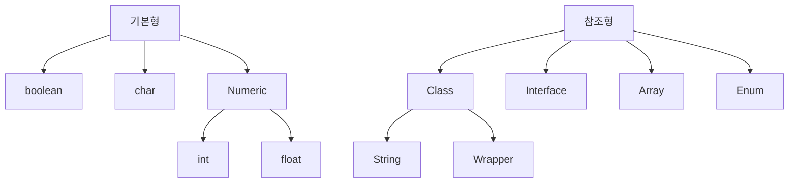

## 자료형 분류

 

## 기본형
- 운영체제에 따라 자료형의 길이가 변하지 않는다
- 객체가 아니기 때문에 null을 가질 수 없다
- 비교시 == 사용

|이름|타입|bit|범위|
|--|--|--|--|
|boolean| 논리| 8||
|char| 문자| 16| true / false|
|byte| 정수| 8| -128 ~ +127|
|short| 정수| 16| -32,768 ~ +32,767|
|int| 정수| 32| -2,147,483,638 ~ +2,147,483,647|
|long| 정수| 64|-9,223,372,036,854,775,808 ~ +9,223,372,036,854,775,807|
|float| 소수점| 32|-3.402932347e+38 ~ +3.40292347e+38|
|double| 소수점| 64|-179769313486231570e+308 ~ 1.79769313486231570e+08|

 

## 참조형
- 기본형을 제외한 데이터 타입
- 기본적으로 Object를 상속 받는다
- 데이터를 다른 영역에 저장하고 변수에는 해당 데이터의 참조값을 저장한다
- 비교시 equals() 사용

|이름|설명|
|--|--|
|String| 문자열 표현, 불변 객체(내용 변경시 새로 만들어짐)|
|Wrapper| 기본형을 클래스로 감싼 형태의 객체 (null 가능)|
|Interface| 동일한 목적 하에 동일한 기능을 보장하기 위한 자료형|
|Array| 자료형에 []을 사용하여 배열로 지정 (기본형, 참조형 모두 가능)|
|Enum| 열거형 표현, `public enum name {member1, member2}`|
