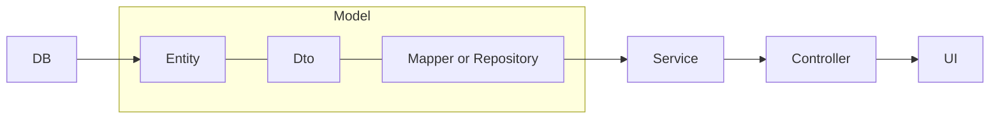

## 기본구성
- Spring Boot + Thymeleaf + JPA + Mybatis + AUIGrid(그리드 구성을 위한 상용 라이브러리)
<br>

## 구현 순서
1. 폴더 계층 구조 형성
2.  Entity에서 ~.java파일 작성 (모델)
3.  Dto에서 ~Dto.java파일 작성
4.  Mapper에서 ~MasterMapper.java파일 작성 (Mybatis)
5.  Repository에서 ~Repository.java파일 작성 (JPA)
6.  Service에서 ~Service.java파일 작성 (인터페이스)
7.  Service의 Impl에서 ~ServiceImpl.java파일 작성
8.  Controller에서 ~Controller.java 파일 생성
9.  Controller에서 ~RestController.java 파일 생성
10. Sql에 ~sql.xml 쿼리 작성 (Mybatis)
11. Template에 html 파일 작성 (뷰)



<br>

## 컨트롤러
- @RestController = @Controller + @ResponseBody
- @Controller ~ @RequestMapping = return이 template에 있는 html과 연결됨 (view 자동 매핑)
- @Controller ~ @RequestMapping + @ResponseBody = return이 있는그대로 반환됨
<br>

## Request 사용
- 컨트롤러에서 request.getParameter("이름") 사용시 이름은 html에서 name으로 정의해줘야 한다 (id는 못읽음)
<br>

## 컨트롤러 매개변수
- 컨트롤러로 보내려는 매개변수를 필드로 가지고 getter() setter() 메소드를 가지는 클래스를 사용하면 한번에 전송가능

```java
public void start(@RequestParam(value="page", defaultValue="0")     int page,
				  @RequestParam(value="word", defaultValue="") 	    String word,
				  @RequestParam(value="type", defaultValue="title") String type,
				  Model model) { ... }
```

<font size="10">&emsp; &emsp; &emsp; &emsp; &emsp; &emsp; &emsp; &emsp; ↓</font>

```java
public void start(@ModelAttribute("ui") test<Map<String, Object>> ui,
				  Model model) { ... }
```
