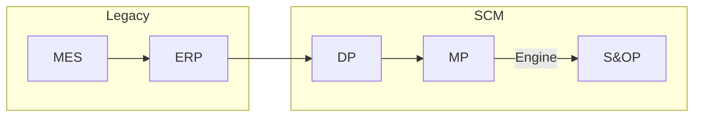

## Enterprise Resource Planning (ERP)
- 전사적 자원 관리
- 일상적인 비즈니스 활동을 관리하는데 사용하는 소프트웨어
- SAP, 영림원, 오라클ERP, 더존 등의 종류가 있다
  → 기업마다 ERP가 달라서 화면 단위로 데이터 구조 협의 필요
- ERP DB담당자와 협의해서 데이터 가져온다 (DB to DB)
- 일반적으로 프로시저로 데이터를 전달 
  → where절을 못 넣어서 데이터 조작 어려움 
  →별도로 데이터를 관리하는 테이블 만드는 기능 필요
 

## Manufacturing Execution System (MES)
- 제조실행 관리 시스템
- 공장안의 모든 것을 데이터로 관리하고 설비와 상호작용 하며 생산관리 능력을 향상시킨다
- 센서를 사용해 얼마나 생산되었는지 자동으로 기록한다
 

## Demand Planning (DP)
- 수요계획
- 제품의 필요량, 판매량, 재고, 단가, 과거 생산량 등의 정보를 취합하여 출력
- 고객, 제품의 기준정보를 등록 후 수요계획을 관리하여 input 데이터 생성
- input 데이터는 ERP에서 I/F한 데이터와 DP, MP 기준정보를 합쳐서 생성
 

## Master Planning (MP)
- 생산 및 전략계획
- 경영자측의 의사결정용 플래닝이 목적이지만 실제로는 현업에서 실행용으로도 사용한다
- 플래닝으로 결과를 만들어 주는 역할
- weekly 엔진 = 3개월 정도의 전체적인 계획
- daily 엔진 = 매일 어떻게 생산 해야하는 지에 사용
 

## Sales and Operations Planning (S&OP)
- 영업 및 운영계획
- 수요와 공급의 균형을 이루어 수익성 향상을 돕는 프로세스
- 차트 등을 이용한 레포트 페이지로 현재와 미래예측 상황을 확인하여 장기적인 생산계획과 경영전략 수립을 위해 사용
- output 데이터를 이용하여 레포트를 생성한다
- 레포트 데이터는 회사마다 상이하며 PSI 등으로 이루어져 있다
 

## Production Sales Inventory (PSI)
- 각 제품에 대한 판매, 생산, 재고를 한번에 출력하는 페이지
- 해당 페이지를 사용하여 재고를 관리한다
 

## Factory Planning and Scheduling (FP)
- 공장 생산계획
- 엔진 결과로 나온 데이터를 이용하여 어떤 제품을 언제 얼마나 생산해야 하는가에 대한 계획
- 주로 분 단위 간트차트를 이용하여 표현

 

## Legacy Data
- ERP 에서 전달 받아야 하는 데이터

|이름|내용|
|---|---|
|BOM| Bill of Material, 자재 명세서 제품을 만드는 재료의 코드를 정의 (원자재 → 반제품 → 완제품)|
|판매 주문| 수요 데이터, 회사의 매출과 동의어 "무엇을 어떤사람이 언제 몇개 주문했다"|
|Forecast| 갑작스런 주문에 대응하기 위한 예측 데이터|
|재고| 창고에 쌓여있는 제품에 대한 데이터|
|생산 주문| 생산 지시 데이터|
|구매 주문| 원자재 구매에 대한 데이터 ex) 납품수량, 미납수량, 입고수량|

 

## Input
- 생산 계획을 생성하기 위해 정의해야 하는 데이터

|이름|내용|
|---|---|
|Demand| 판매계획, 수요 "어디에 무엇을 언제까지 몇개" 정의|
|Bucket| 생산 한계를 설정  ex) 1일 생산 가능수량, 1주 생산 가능수량|
|Bucket Info| `Bucket`을 정의 ex) 몇개를 가질수 있는가, 단위|
|Calendar| 휴일 정보|
|Capa| 설비에 대한 생산한계 정의 ex) 쓸 수 있는 시간, 생산 가능 수량|
|Bucketratio| `Bucket`에 대한 `Capa`용량 재정의 ex) `Bucket` = 0.5, `Capa` = 20 일때, 10|
|Material Load| 제품별로 각각 부하량 정의 ex) 제품 만드는데 걸리는 시간|
|Multiplant| 각 제품에 대한 공장 정보 정의|
|Multiresource| 각 제품에 대한 설비 정보 정의|
|Cprodplan| 확정생산 계획|
|Frozen| 계획을 수립하지 않는 예외구간 정의|
|Safety Stock| 예측할 수 없는 수요에 대한 보험인 안전재고 정의|
|Yield| 수율 정의 ex) 100만큼 투입하여 98만큼 생산하면 수율은 98%|
|SBOM| 제품상세, Bom + Routing ex) 제품을 만드는데 필요한 원자재와 설비, 공정 정보를 가진 데이터 모델|

 

## 제품 종류

|이름|내용|
|---|---|
|제품| 완성품|
|반제품| 완성품을 만들기 위한 부품 그 자체로 판매 가능|
|재공품| 완성품을 만들기 위한 부품 그 자체로 판매 불가능|

 

## SCM 흐름

