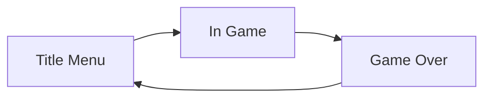

## 기본사항
- `Unity`는 특정 스크립트를 컴포넌트로 가지는 `GameObject`를 기반으로 상호작용 하여 게임이 만들어 진다
  ex) 캐릭터 외에도 화면을 보여주는 카메라나 게임을 관리하는 게임 매니저도 전부 `GameObject`
- 코드 수정은 `Visual Studio`에서 이루어 진 후 `Unity`로 반영된다
- 추가한 스크립트를 `GameObject`에 드래그하여 컴포넌트를 추가 가능
- `Unity`에서 게임 제작을 위해 물리적 움직임이나 카메라 등의 기본 컴포넌트를 지원한다
- 프레임을 중심으로 게임이 진행되며 이에 따라 `Awake()`, `Update()` 등으로 생명주기를 관리된다
- 다른 스크립트에 접근하기 위해 싱글톤 패턴을 사용한다
- `InputManager`를 통하여 키보드 입력을 설정한다
- 포토샵 같이 `GameObject`마다 레이어를 부여 가능하며 특정 레이어에 접촉한 경우를 트리거로 사용할 수 있다
- 버튼 이벤트는 버튼 컴포넌트에 특정 `GameObject`를 설정하고 해당 메소드를 호출하는 식으로 이루어진다
- 이벤트를 컨트롤하는 `EventSystem` 생성을 지원한다
- 캐릭터의 움직임을 구현하는 스프라이트는 `Animator` 객체로 구현된다
- 컴포넌트에서 선언한 변수에 `Unity`의 `Inspector`를 통해 특정 `GameObject`를 할당 할 수 있다
 

## 게임 설계
- 상태를 기반으로 게임을 설계한다

 

## 프로젝트 구조

|Game Object|내용|
|--|--|
|Game Manager| 게임 상태 관리 (menu, inGame, gameOver)|
|Event System| 이벤트 처리 (GameObject → UI → EventSystem)|
|Main Camera| 화면 컨트롤|
|UI| 3개의 화면으로 게임 상태 컨트롤|
|⨽ Menu Canvas| 메뉴 화면|
|⨽ In Game Canvas| 게임 화면|
|⨽ Game Over Canvas| 게임오버 화면|
|Player| 유저가 움직일 캐릭터 관리|
|Level Generator| 플랫폼의 생성, 제거를 관리|
|startPoint| 플랫폼이 처음 생성될 위치 정보|
|Level Piece Basic| 기본 플랫폼|
|Level Piece Hole| 다른 형태의 플랫폼|
