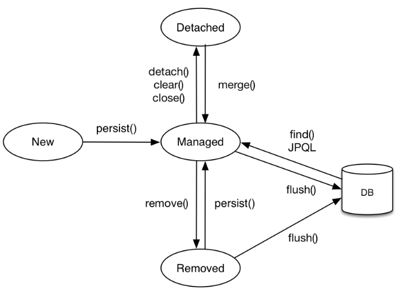
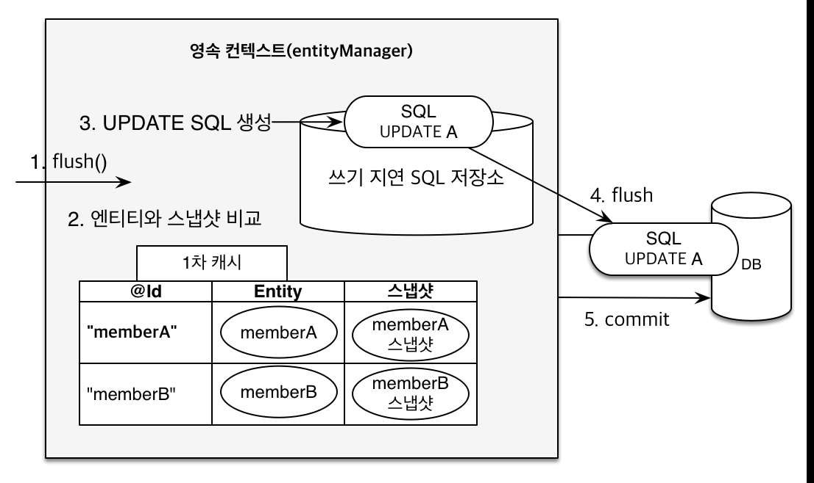

## 구조


|이름|설명|
|--|--|
|Persistence Unit|`EntityManager`가 관리하는 모든 `Entity`클래스 집합을 정의|
|Persistence|`EntityMangerFactory` 객체를 가져오기 위한 메소드를 가진 클래스|
|Entity Manager Factory|`EntityManger`생성 클래스<br>`PersistenceUnit`에 의해 애플리케이션 실행시 한번만 생성|
|Entity Manager|실제로 DB와 상호작용을 하기위한 인터페이스<br>각 인스턴트는 `PersistenceContext`와 연결되어 있다|
|Persistence Context|DB와 매핑된 필드를 가진 `Entity`를 처리 (영구 저장환경)|
|Entity Transaction|각 `EntityManger` 인스턴스의 동작은 `EntityTransaction` 클래스로 관리된다|
|Query|쿼리 실행을 제어하는데 사용되는 인터페이스|
|Criteria|컴파일 시간에 확인 가능한 안전한 유형의 쿼리를 만드는데 사용하는 API|
|Entity|DB의 테이블에 대응하는 클래스|
<br>

## Entity 생명주기


|이름|설명|
|--|--|
|New (비영속)|`PersistenceContext`와 관계가 없는 새로운 상태|
|Managed (영속)|`PersistenceContext`에 엔티티가 저장되어 관리되는 상태<br>커밋 시점에 DB에 반영된다|
|Detached (준영속)|`PersistenceContext`에 저장되었다가 분리된 상태|
|Removed (삭제)|`PersistenceContext`와 DB에서 삭제된 상태|

```java
Item item = new Item(); // 비영속 상태
item.SetItemNm("테스트 상품");

EntityManagerFactory emf = Persistence.createEntityManagerFactory(persistenceUnitName : "Test");

EntityManager em = emf.createEntityManager();

EntityTransaction tx = em.getTransaction();
tx.begin(); // 트랜잭션 실행

em.persist(item); // 영속 상태

tx.commit();

// 사용한 자원 반환 (준영속 상태)
em.clear();
emf.close();
```
<br>

## Persistence Context 의 장점
- 1차 캐시 지원
 → Map<Key, Value> 형태로 저장하여 find() 호출시 1차 캐시를 조회
 → `Entity`가 존재하면 반환하고 없을 경우, DB에서 조회 후 1차 캐시에 저장 및 반환한다
- 동일성 보장
  → 하나의 트랜잭션에서 같은 키값으로 `PersistenceContext`에 저장된 `Entity`조회 시 같은 `Entity` 조회 보장
  → 1차 캐시에 저장된 `Entity`를 조회하기 때문
- 트랜잭션을 지원하는 쓰기 지연 (Write Behind)
  → persist() 호출 시 1차 캐시에 저장되는 동시에 `쓰기 지연 SQL저장소`에 SQL문 저장
  → SQL문을 저장소에 쌓아두다 커밋 시점에 SQL문들이 flush 되면서 DB에 반영된다
  → 여러 SQL문을 한번에 보내기 때문에 네트워크 호출을 최소화 하여 성능적으로 유리
- 변경 감지 (Dirty Checking)
  → 1차 캐시에 DB에서 불러온 `Entity`의 스냅샷 값을 보유
  → 1차 캐시에 저장된 `Entity`와 스냅샷을 비교하여 변경이 있으면 `쓰기 지연 SQL저장소`에 Update문을 저장
  → 커밋 시점에 변경내용이 자동으로 반영된다
 

